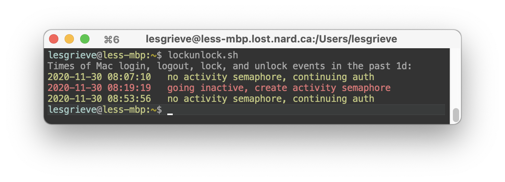

# lockunlock
macOS script to display log in/out time

Display the date and time of macOS log messages associated with login, unlock, lock, and reboot. Output lines associated with lock or shutdown in red, green for login and unlock.

Usage:
```
lockunlock.sh {duration}
```
duration: passed directly to `log show --last`, default 1d; 1 day. Can be any number of minutes (m), hours (h), or days (d).

Tested to work on macOS 11.0 Big Sur, up to 13.0 Ventura.



Inspired by discussion at
https://apple.stackexchange.com/questions/331589/any-way-to-get-the-last-times-the-screen-was-unlocked-in-macos/
